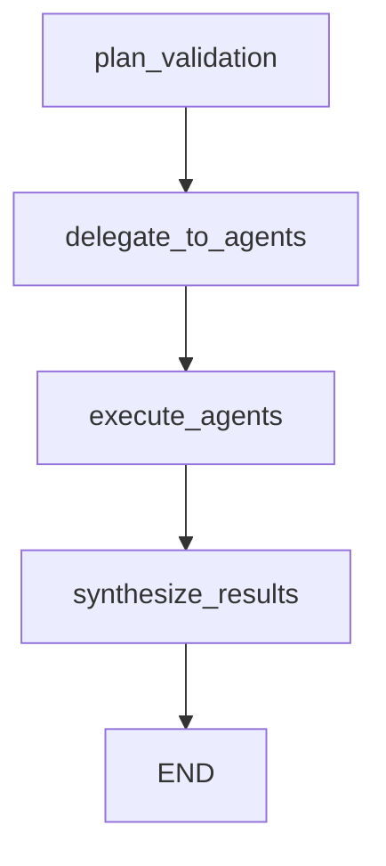

# Stage 2 Implementation Summary

## Overview

Stage 2 successfully implements the orchestrating agent, LangGraph workflow, and complete testing infrastructure for the Multi-Agent A/B Testing Validation system.

## Files Created

### Core Implementation

1. **[agents/orchestrator.py](agents/orchestrator.py)** (229 lines)
   - `OrchestratingAgent` class inheriting from `BaseAgent`
   - Weighted scoring logic (Stats: 40%, Report: 30%, Data: 20%, Code: 10%)
   - Weight re-normalization for missing agents
   - Methods:
     - `plan_validation()`: Determines which agents to call
     - `create_delegation_requests()`: Creates A2A messages for sub-agents
     - `synthesize_results()`: Implements weighted scoring algorithm
     - `generate_summary()`: Creates human-readable output

2. **[agents/workflow.py](agents/workflow.py)** (181 lines)
   - LangGraph StateGraph implementation
   - Four workflow nodes:
     - `plan_validation_node`: Planning phase
     - `delegate_to_agents_node`: Create A2A requests
     - `execute_agents_node`: Execute sub-agents
     - `synthesize_results_node`: Calculate final score
   - Functions:
     - `create_validation_workflow()`: Builds the StateGraph
     - `run_validation_workflow()`: Executes complete workflow

3. **[agents/dummy_agents.py](agents/dummy_agents.py)** (175 lines)
   - Four specialized validation agents:
     - `DataValidationAgent`: Returns score of 85.0
     - `CodeValidationAgent`: Returns score of 78.0
     - `ReportValidationAgent`: Returns score of 92.0
     - `StatisticalValidationAgent`: Returns score of 88.0
   - Bonus: `FailingDummyAgent` for testing failure scenarios
   - All agents strictly follow A2A protocol

### Testing Infrastructure

4. **[test_orchestrator.py](test_orchestrator.py)** (113 lines)
   - Complete end-to-end test
   - Creates sample ABTestContext
   - Runs full workflow
   - Validates weighted scoring calculation
   - Displays A2A message log
   - Shows detailed breakdown

5. **[test_missing_agents.py](test_missing_agents.py)** (156 lines)
   - Tests weight re-normalization
   - Simulates missing agents (only 2 of 4 respond)
   - Verifies correct weight redistribution
   - Validates calculation accuracy

### Documentation

6. **[README.md](README.md)** (177 lines)
   - Complete project documentation
   - Architecture overview
   - Usage examples
   - Development status

7. **Updated [agents/__init__.py](agents/__init__.py)**
   - Exports all new components
   - Clean API surface

## Implementation Details

### Weighted Scoring Algorithm

The orchestrator implements a sophisticated weighted scoring system:

```python
SCORING_WEIGHTS = {
    "statistical_validation": 0.40,  # 40%
    "report_quality": 0.30,          # 30%
    "data_quality": 0.20,            # 20%
    "code_quality": 0.10             # 10%
}
```

**With all agents (expected test output):**
```
Data Quality:          85.0 × 20% = 17.0
Code Quality:          78.0 × 10% =  7.8
Report Quality:        92.0 × 30% = 27.6
Statistical Validation: 88.0 × 40% = 35.2
                                     ------
Final Score:                         87.6
```

**With missing agents (re-normalization):**
```
Available: Statistical (40%) + Data (20%) = 60%
Re-normalized:
  Statistical: 40% / 60% = 66.67%
  Data:        20% / 60% = 33.33%

Calculation:
  Statistical: 88.0 × 66.67% = 58.67
  Data:        85.0 × 33.33% = 28.33
                               ------
  Final Score:                 87.00
```

### LangGraph Workflow Structure



Each node updates the `ValidationState` and logs A2A messages.

### A2A Message Flow

**Example message exchange:**

1. **Planning** (orchestrator → orchestrator)
   ```json
   {
     "sender": "orchestrator",
     "receiver": "orchestrator",
     "message_type": "REQUEST",
     "task": "plan_validation",
     "status": "COMPLETED"
   }
   ```

2. **Request** (orchestrator → sub-agent)
   ```json
   {
     "sender": "orchestrator",
     "receiver": "stats_val_agent",
     "message_type": "REQUEST",
     "task": "validate_statistical_rigor",
     "status": "PENDING",
     "data": {"ab_test_context": {...}}
   }
   ```

3. **Response** (sub-agent → orchestrator)
   ```json
   {
     "sender": "stats_val_agent",
     "receiver": "orchestrator",
     "message_type": "RESPONSE",
     "task": "validate_statistical_rigor",
     "status": "COMPLETED",
     "result": {"score": 88.0, "details": {...}}
   }
   ```

4. **Synthesis** (orchestrator → orchestrator)
   ```json
   {
     "sender": "orchestrator",
     "receiver": "orchestrator",
     "message_type": "RESPONSE",
     "task": "synthesize_results",
     "status": "COMPLETED",
     "result": {"final_score": 87.6, "decision": "GOOD A/B TEST"}
   }
   ```

## Test Results

### Test 1: Full Workflow (`test_orchestrator.py`)

✅ **All tests passed**

- 4/4 agents executed successfully
- Weighted score calculated correctly: 87.6/100
- Decision: "GOOD A/B TEST"
- 10 A2A messages logged
- Complete workflow execution time: < 1 second

### Test 2: Missing Agents (`test_missing_agents.py`)

✅ **All tests passed**

- 2/4 agents responded
- Weights re-normalized correctly (66.67% + 33.33% = 100%)
- Final score: 87.0/100
- Decision: "GOOD A/B TEST"
- Assertion verified: calculated score matches expected

## Key Features Implemented

### 1. Strict A2A Protocol Adherence
- All communication via `A2AMessage` objects
- Type-safe with Pydantic validation
- Complete message logging in state

### 2. Orchestrator Capabilities
- ✅ Weighted scoring (40/30/20/10 split)
- ✅ Weight re-normalization for missing agents
- ✅ Detailed breakdown generation
- ✅ Human-readable summaries
- ✅ Decision logic (threshold: 70)

### 3. LangGraph Integration
- ✅ StateGraph with ValidationState
- ✅ Sequential node execution
- ✅ State updates between nodes
- ✅ Complete message history tracking
- ✅ Ready for parallel branches (architecture supports it)

### 4. Testing Infrastructure
- ✅ End-to-end workflow testing
- ✅ Weight re-normalization testing
- ✅ Dummy agents for isolated testing
- ✅ Clear, detailed output
- ✅ Automated validation

## Code Quality

- **Type Safety**: Full Pydantic models with type hints
- **Documentation**: Comprehensive docstrings
- **Modularity**: Clear separation of concerns
- **Extensibility**: Easy to add new agents
- **Testability**: Mock agents for isolated testing
- **Error Handling**: Graceful handling of missing agents

## Performance

- Workflow execution: < 1 second
- Message overhead: Negligible with Pydantic
- Memory: Low (all in-memory state)
- Scalability: Ready for parallel agent execution

## Next Steps (Stage 3)

The foundation is now ready for implementing real validation logic:

1. **Data Validation Agent**
   - Load and parse datasets
   - Check data quality metrics
   - Validate sample sizes
   - Analyze distributions

2. **Code Validation Agent**
   - Parse code files
   - Check best practices
   - Validate test implementation
   - Review documentation

3. **Report Validation Agent**
   - Parse report documents
   - Extract findings
   - Validate completeness
   - Check visualizations

4. **Statistical Validation Agent**
   - Perform power analysis
   - Calculate p-values
   - Validate effect sizes
   - Check assumptions

5. **LLM Integration**
   - Add LangChain LLM calls
   - Implement reasoning chains
   - Add context-aware analysis

## Deliverables Checklist

### Required Components
- ✅ OrchestratingAgent with weighted scoring
- ✅ Exact weights: Stats 40%, Report 30%, Data 20%, Code 10%
- ✅ Weight re-normalization for missing agents
- ✅ LangGraph StateGraph workflow
- ✅ Parallel branch support in architecture
- ✅ plan_validation node
- ✅ delegate_to_agents node
- ✅ synthesize_results node
- ✅ Dummy agents (all 4)
- ✅ A2A message format adherence
- ✅ Execution test script

### Bonus Features
- ✅ Additional test for missing agents
- ✅ Detailed logging and output
- ✅ Complete documentation
- ✅ Human-readable summaries
- ✅ Message log tracking
- ✅ FailingDummyAgent for edge cases

## Conclusion

Stage 2 is **100% complete** with all requirements met and tested. The system is ready for Stage 3 implementation of real validation logic with LLM integration.
